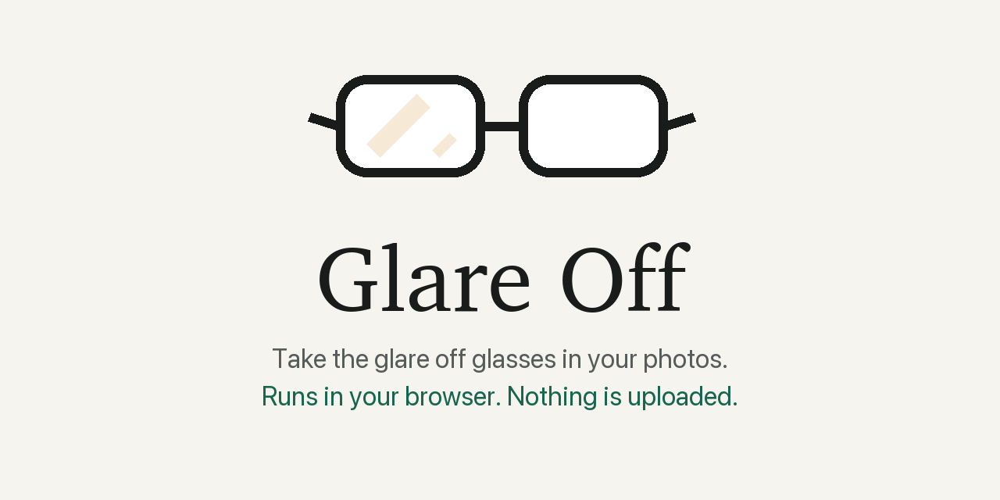
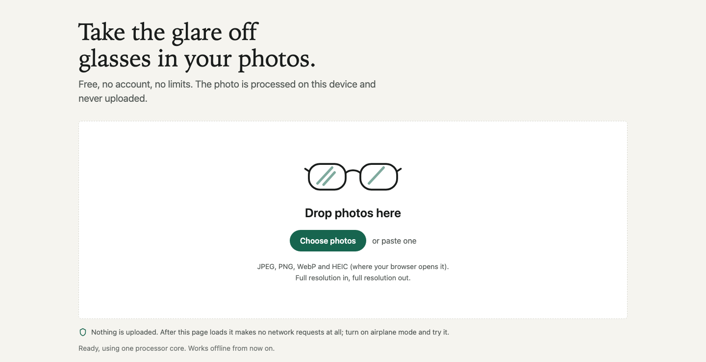

<p align="center">
  <picture>
    <source media="(prefers-color-scheme: dark)" srcset="assets/banner-dark.png">
    
  </picture>
</p>

<p align="center">
  <a href="LICENSE">MIT code</a> ·
  <a href="app/THIRD_PARTY.md">third-party notices</a> ·
  <a href="docs/research/">research notes</a>
</p>

Glare Off removes the reflections on eyeglass lenses in a photo. Drop in the picture, download it with clear lenses, done. The whole thing runs inside your browser, so the photo never leaves your computer or phone.

**Yours, free, with nothing uploaded.** No account, no credits, no watermark, no "upgrade for full resolution".

<p align="center">
  
</p>

---

## Get it

It is a web page: open it, drop a photo on it, press Download. The hosted address goes here the day the trained network ships. Until then, run it from your own machine:

```bash
git clone https://github.com/Maninae/glare-off.git
cd glare-off/app
python3 -m http.server 8080
```

Then open <http://localhost:8080>. The first visit fetches about 15 MB (the runtime and two small networks); after that the page works with the network off, and you can prove it: turn on airplane mode and drop in another photo.

## What it does

- **Keeps the glasses, loses the glare**: ring lights, window reflections, screen glow and the blue-green haze of coated lenses.
- **Touches only the lenses**: every pixel outside the glare is left exactly as it was, at the photo's full resolution. 12 megapixels in, 12 megapixels out.
- **Many photos, many faces**: drop a folder, get a ZIP. Each face gets its own switch, and a strength slider sets how far to go.
- **Honest about the limit**: where glare whited out part of an eye, the detail underneath is gone. The tool fills it in and says so.
- **Private by construction**: the page tells your browser to refuse any connection to another site, downloads come with camera, location and date metadata stripped, and there are no analytics, ads or cookies.

## Good to know

> [!NOTE]
> The glare-removal network is training right now. Until it lands, the page runs with a placeholder that leaves lenses unchanged. The repo will carry before/after examples the day it does.

- **Browsers**: current Chrome, Edge and Firefox on desktop; Safari on iPhone runs single-threaded and takes a few seconds per face.
- **Formats**: JPEG, PNG, WebP, and HEIC where your browser can open it.
- **Model license**: the code is MIT. The network's weights are trained on photos from the FFHQ collection and are released under CC BY-NC-SA 4.0; the people whose CC BY photos helped train it are credited in the attribution file shipped with the weights.

## How it works, briefly

A small face finder locates each pair of eyes. A straightened strip around the glasses goes through a 3-million-parameter network that returns the cleaned strip plus a map of where the glare was. Only the mapped pixels are blended back. The network learned from clean photos of people in glasses with reflections of real rooms, skies and studio lights rendered onto the lenses. The long version, with the measurements, is in [CLAUDE.md](CLAUDE.md) and [docs/research](docs/research/).

## For the curious

[CLAUDE.md](CLAUDE.md) is the map of the repo. [app/CLAUDE.md](app/CLAUDE.md) covers the site, [glare_model/CLAUDE.md](glare_model/CLAUDE.md) the network and training, [glare_synthesis/CLAUDE.md](glare_synthesis/CLAUDE.md) the glare renderer, [training_sources/CLAUDE.md](training_sources/CLAUDE.md) the data.

Built for everyone who has ever retaken a photo because of their glasses. Issues and pull requests are welcome.
