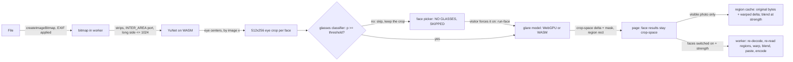

# app/: the Glare Off static site

The whole deployed artifact: plain HTML/CSS/ES-module JS, no framework, no bundler, no build step, no node_modules. Serve this directory as-is. Product contracts (eye crop, model I/O) live in the repo-root `CLAUDE.md`; this file covers the site.

## Pipeline (all in one Web Worker)



## Module map

| Path | Owns |
|---|---|
| `index.html` | Page shell, the CSP meta tag (commented in place), every static DOM node, the result-card `<template>`. |
| `js/main.js` | Wiring: service-worker control, runtime choice, engine start, the sequential photo queue, the visible-photo region cache, downloads and "Download all". |
| `js/debug_hook.js` | `window.__glareOffDebug` (e2e test hook), installed only with `?debug` in the URL: state, timings, on-demand warped masks, a memory description. |
| `js/app_config.js` | Product name, model and runtime paths, switches (`HIGH_RES_PASS_ENABLED`), export qualities. |
| `js/eye_crop_geometry.js` | **Contract.** Line-for-line port of `eye_crop/eye_crop_geometry.py` (affine, scale, inverse). |
| `js/pipeline/glare_worker.js` | The module worker: loads ORT + the three sessions, decodes photos, reads pixels in strips/regions, runs detection and gated face passes (+ an eye-crop thumbnail per face), runs a skipped face on demand (`run-face`), re-reads regions for the page (`read-regions`), exports. |
| `js/pipeline/glare_engine.js` | The engine's page-side lifecycle: start/restart the worker with all three models, serialize model work (`run`), sleep on phones, the model-free pixel worker for reads and exports. |
| `js/pipeline/worker_client.js` | Main-thread side: blob bootstrap (so the CSP governs the worker), request ids to Promises, terminate. |
| `js/pipeline/runtime_choice.js` | WebGPU (real adapters only) vs WASM; thread count (iPhone/iPad 1, other mobile <= 2); which devices free memory between batches. |
| `js/pipeline/yunet_face_decode.js` | YuNet pre/post-processing ported from OpenCV FaceDetectorYN (pad to 32, BGR 0-255, anchor decode, sqrt(cls*obj), integer-box NMS). |
| `js/pipeline/area_downscale.js` | OpenCV INTER_AREA port, streamed over row strips (the detector's downscale for big photos). |
| `js/pipeline/eye_crop_warp.js` | Photo -> crop (bilinear, reflect-101) and crop layers -> photo region (bilinear, zero border). |
| `js/pipeline/glare_crop_pass.js` | One face: crop (`extractFaceEyeCrop`, reusable), model, crop-space delta with the half-level cut, optional 2x pass. Returns crop-space layers + the region rect only. |
| `js/pipeline/glasses_gate_pass.js` | The glasses gate: crop once, classify, glare pass only when `p >= GLASSES_PROBABILITY_THRESHOLD`; a skipped face keeps its crop as three planes; `runSkippedFaceGlarePass` runs it later. |
| `js/pipeline/eye_crop_thumbnail.js` | The face picker's thumbnail of an eye crop (ImageBitmap, made in the worker). |
| `js/blend/face_patch_blend.js` | `round(original + strength * 255 * delta)`; zero delta keeps the exact byte. |
| `js/blend/face_region_patch.js` | On-demand warp of a face's crop-space delta/mask to its photo region, and the full-res patch (used by the cache, the export and the test hook). |
| `js/photo/photo_file_types.js` | Format sniffing (HEIC etc.), output format choice, download names. |
| `js/photo/photo_compose.js` | Full-res patches from the region cache, the composed "after" preview, region canvases for the eye zoom. |
| `js/photo/visible_photo_regions.js` | The ONE-photo cache of full-res region bytes + warped deltas (the photo last landed or touched); switching photos drops it and re-reads through a worker. |
| `js/photo/zip_store.js` | STORE-only ZIP writer with CRC-32 for "Download all". |
| `js/ui/input_doors.js` | File picker, whole-page drag-and-drop, paste. |
| `js/ui/engine_status.js` | The status line: real-MB download progress, ready, error with Try again. |
| `js/ui/compare_view.js` | Before/after canvases, the divider with its handle, the transparent range input that drives it. No animation (the one fade is CSS). |
| `js/ui/result_card.js` | One photo: states, owns each face's override, face picker, view picker (whole photo / eyes up close), strength, lost-detail notes, Download. Redraws are async (they may wait for a region re-read). |
| `js/ui/face_picker.js` | The tile row under the compare view: one `<button aria-pressed>` per face with its eye crop and a state label. Draws only. |
| `js/ui/face_switch_state.js` | The per-face state machine and tile labels (pure; tested in Node). |
| `sw.js` | Service worker: shell precache, runtime caching of models and ORT, COOP/COEP/CORP headers on everything it serves. |
| `asset_manifest.json` | Generated list of every served file with sizes; feeds the SW precache, the cache version and the progress bar. |
| `styles/tokens.css`, `page.css`, `explainer.css`, `results.css` | Tokens (the only color values, light and dark), the welcome column and its collapsed header row, the how-it-works drawings and privacy icons, the result cards. |
| `fonts/` | Optician Sans (OFL 1.1) woff2 and its license text, from the earlier eye-chart design; no longer referenced by the CSS. See `THIRD_PARTY.md`. |
| `models/` | `face_detection_yunet_2023mar_dynamic_input.onnx` (served), the stock YuNet (Python only, not served), `glare_removal.onnx` (owned by `glare_model/`; see its README), `glasses_classifier.onnx` (owned by `glasses_classifier/`; input `eye_crop` [1,3,256,512], output `glasses_probability` [1,1]). |
| `vendor/onnxruntime-web-1.30.0/` | Two ORT builds, verbatim from the npm tarball. See `THIRD_PARTY.md`. |
| `icons/`, `manifest.webmanifest`, `404.html` | Favicon set rendered from `icons/favicon.svg` (black tile, white glasses), install manifest, link preview card (a screenshot of the empty state). |

## The glasses gate and the face picker

Every detected face is cropped once; the classifier and the glare model get the same tensor. Per-face state (`ui/face_switch_state.js`), from the gate's decision and one override bit a tile press flips:

| State | Glasses detected | Overridden | Glare model | In the blend and download |
|---|---|---|---|---|
| `auto-on` | yes | no | ran at processing | yes (label "Glare removed", or "No glare found" if its mask was empty) |
| `auto-off` | no | no | never ran | no, pixels untouched ("No glasses, skipped") |
| `user-on` | no | yes | runs on demand from the kept crop (`run-face`), label "Working" meanwhile | yes ("Forced on") |
| `user-off` | yes | yes | ran | no ("Forced off") |

- A second press returns to the automatic state. A face is blended only when switched on AND its glare mask is non-empty; `currentExportSettings()` sends exactly those faces, so the download follows the picker.
- Card states: `done` (some face has glare), `no-glare` (faces checked, none had glare), `no-glasses` (every face skipped; Download disabled until a forced face finds glare), `no-face`.
- `GLASSES_PROBABILITY_THRESHOLD` lives in `js/app_config.js`; `?glassesthreshold=N` overrides it (the e2e uses 2 to skip every face).

## Invariants (do not relax while iterating)

- **No other origin, ever.** CSP `default-src 'none'`, `connect-src 'self'`. The page's privacy row ("Once loaded, it makes no network requests") is pinned by the e2e test; any change that makes it false is out of scope.
- **The worker must start from the blob bootstrap** in `worker_client.js`. A worker loaded from its own URL takes its CSP from HTTP headers, and static hosts send none.
- **Untouched pixels stay byte-identical.** A crop pixel whose mask is below 0.5/255, or whose `mask * (clean - crop)` is below half a level on all three channels, gets delta 0 and mask 0 (and does not count toward "glare found" or the lost-detail note). So an idle mask head (~0.02 everywhere) touches nothing by construction, the warped delta is exactly 0 outside the mask, and `blendFacePatch` leaves those bytes alone. Downloads are a fresh decode of the original with only the patched regions pasted.
- **Per-photo memory does not scale with the photo.** Face results keep crop-space layers only (~2 MB per glare face at 512x256; a skipped face keeps its 1.5 MB crop). Full-res region bytes and warped deltas (~16 B per region pixel) exist for one photo at a time (`visible_photo_regions.js`) and inside the worker during an export. The e2e test asserts no face result holds a region-size array.
- **Faithful ports.** Geometry, YuNet decode, INTER_AREA and the warps reproduce the Python/OpenCV reference. Change the Python first, regenerate fixtures, re-run the parity tests; never "improve" the JS alone. One non-obvious detail: OpenCV takes the rotation center as float32, so the JS rounds it with `Math.fround`.
- **Nothing depends on the glare model's behavior.** The app reads only the contract shapes; the stub and the trained model are interchangeable.
- **No pixels in storage.** Photos live in memory only (worker bitmaps, page canvases). Nothing goes to localStorage or IndexedDB.
- **Bump the manifest after any file change:** `python -m tests.app.sync_asset_manifest` (the e2e test fails while it is stale). It stamps the cache version into `sw.js`.
- **Never use the word "AI" as a selling point** in UI copy.

## Runtime decisions

- **Build choice:** WebGPU build only when `requestAdapter()` returns a real GPU. Software fallbacks (SwiftShader, `isFallbackAdapter`) are refused: in testing they ran the model ~50x slower than threaded WASM. Otherwise the CPU-only build (14 MB vs 27 MB of WASM). If the WebGPU session fails to create, the same build runs on its CPU path. `?backend=wasm|webgpu` overrides.
- **YuNet always on WASM** (its input size changes per photo; on WebGPU every size recompiles shaders).
- **Multithreading: yes, via our own service worker, without a reload.** `sw.js` adds COOP/COEP to everything it serves, so from the second visit the page is cross-origin isolated and ORT uses up to 4 threads. Measured gain: ~2.2x per face. The usual coi-serviceworker shim forces a reload on first visit; we skip that, so the first visit simply runs one thread. iPhone/iPad stay at one thread (Safari tab memory limits); every other mobile user agent is capped at 2. `?threads=N` overrides (uncapped, tests only).
- **Memory:** on phones, small tablets and devices reporting <= 4 GB, the worker is terminated when the queue drains (the only way to free a WASM heap); downloads then use a model-free worker. ORT memory arenas are off.
- **Big photos:** the worker never holds a full-size pixel buffer. Detection streams 128-row strips through the INTER_AREA port; crops read only their source region. Export needs one full-size canvas (browser canvas limits apply, see Known limits).

## Measured timings (M4 Mac, Chromium, untrained stub NAFNet 2.93M params, 512x256 crop)

| Runtime | Inference per face | 720 px photo, 2 faces | 27 MP photo, 2 faces |
|---|---|---|---|
| WASM, 1 thread (first visit) | ~350 ms | ~0.8 s | ~1.4 s |
| WASM, 4 threads (second visit) | ~150 ms | ~0.4 s | ~1.0-1.2 s |
| WebGPU, Apple GPU | ~70 ms | ~0.3 s | ~0.8-1.0 s |

Engine start: ~0.5-1 s on WASM, ~1-2.3 s on WebGPU (shader compile), once per visit. On the 27 MP photo, ~400 ms is the INTER_AREA downscale for detection.

## Download size (first visit; later visits come from the cache)

| Part | Raw | gzip |
|---|---|---|
| App shell (31 files) | 0.17 MB | 0.08 MB |
| YuNet | 0.23 MB | 0.20 MB |
| Glare model (stub, fp32) | 11.8 MB | 10.7 MB |
| Glasses classifier (fp16) | 0.37 MB | |
| ORT CPU build (or) | 14.3 MB | 3.7 MB |
| ORT WebGPU build | 26.9 MB | 6.7 MB |
| **Total, CPU path / GPU path** | **26.5 / 39.1 MB** | **14.7 / 17.7 MB** |

The glare model dominates the gzip total; the fp16 export (`glare_removal_fp16.onnx`, about half) is the next lever.

## Design: the waiting room

The page should feel like the README banner (`assets/banner-light.png`): an optician's waiting room with good light, warm and quiet. Owner's verdict on the earlier eye-chart look (pure black on white, Optician Sans in tracked capitals): it did not feel calm or pleasant. Do not drift back to it: no pure `#fff`/`#000` grounds, no letterspaced uppercase, no shrinking stack of tiny rows, no boxed sign rows.

- **Palette** (`styles/tokens.css`, the only color values): paper `#f5f4ef`, white surfaces, headline ink `#191c1b`, body `#3d423f`, secondary `#565c59`, muted `#676d69`, rules `#d8d8cf`, faint drawing strokes `#b4b5ac`, matte `#e2e1d9` behind letterboxed photos, one accent green `#17654f`. Dark mode is designed separately: `#121514` / `#1b1f1d`, text `#e9ece9`, accent `#6cc9a9` (the accent button takes dark text there). Never pure black.
- **Type:** the headline, the brand and the drop overlay in the banner's serif stack (`ui-serif, "New York", "Iowan Old Style", Charter, Georgia, serif`), regular weight, sentence case. Everything else in the system sans, normal tracking, sentence case. Optician Sans is no longer used (its files and `THIRD_PARTY.md` entry stay).
- **Empty state, in reading order:** the glasses glyph, the serif headline, the drop card (row 3, `#drop-zone`: the one white surface with a hairline rule; its border turns green on hover and drag), two promise lines (privacy in the accent, "Free..." in secondary), then the explainer (`styles/explainer.css`), then the version note as one muted line (may run past the column on wide screens). The `chart-*` class names and the `aria-hidden` acuity labels stay in the DOM for scripts and tests; CSS hides the labels.
- **Explainer: pictures before text.** "How it works" is three inline-SVG drawings in one horizontal flow joined by faint dotted arrows (Find: face with a dashed eye box; Clean: the glasses strip, glare streak in `--diagram-faint`, the glare outlined in green dashes; Blend: the face with clear lenses and a green check), each with a one-line caption; the honesty note is a muted footnote under Blend. On phones the steps stack, drawing left and caption right, arrows pointing down. "Private by design" is three slashed icons (upload, location pin, cookie) with captions of at most six words, then the small print "Once loaded, it makes no network requests. Other sites are blocked." Drawings use the glyph's language: stroke-only, rounded caps, `currentColor` ink, green only on what the tool marks. Each SVG has `role="img"` and a `<title>` matching its caption. Tried and rejected: each step on a hairline card (a second family of boxes competing with the drop card, uneven empty space) and the privacy items as one inline line of small icons (wrapped unevenly, icons too small to read).
- **Controls:** Choose photos and Download are accent buttons with white text and a 7 px radius; secondary actions (Add photos, Download all, Try again) are accent text links. Radios and range use `accent-color`. Focus: 2 px accent outline.
- **Results:** the column collapses to a header row (glyph, serif "Glare Off", the two links); each photo is a white card with a hairline rule and 12 px radius. The compare view has a 1 px rule (`outline`, so the photo keeps its exact aspect) over the matte. Before/After are small text labels (brick `#9c4535`, accent green) on a near-white backing; the divider is a white line; the handle a white rounded bar with a thin charcoal ring.
- **Face picker:** 112 px eye-crop tiles in a thin charcoal frame, sentence-case labels ("Glare removed", "No glasses, skipped"). Switched off: crop at 40%, label muted, frame intact. Forced on (`data-state="user-on"`): green frame and green label; that is the only tile state in the accent.
- **Accent budget:** green marks only what the visitor can act on or chose (buttons, links, a forced face, the privacy promise). Most of the page is charcoal on paper.
- **Motion:** the divider following the pointer, a 320 ms fade of the cleaned side when a result lands, 160 ms hover transitions; all off under reduced motion.
- **Whole page is the drop target** (window listeners in `input_doors.js`); the drop card also opens the picker on click; paste works anywhere.
- **Accessibility:** contrast on paper: headline 15.6:1, body 9.3:1, secondary 6.2:1, muted 4.8:1, accent text 6.3:1; white on the accent button 7.0:1; Before label on white 6.3:1. Dark: muted 6.1:1 on the surface, accent 8.4:1. A disabled button is muted text on paper (4.8:1). Labels are sentence case in the DOM and on screen; tap targets >= 44 px.
- `icons/preview.png` is a 1200x630 screenshot of the empty state (light).

## Empty state and the sample slot

There are no demo photos yet (licensing). `#sample-slot` in the drop card (row 3) is hidden and empty; to add "Try a sample", put CC-licensed or consented images under `samples/`, list them with attribution in `THIRD_PARTY.md`, render a button into the slot that feeds the file through `addPhotos([file])` in `main.js`, and re-run the manifest sync.

## Run locally

```
cd app
python3 -m http.server 8000
```

Open `http://localhost:8000/`. Query flags: `?backend=wasm|webgpu`, `?threads=N`, `?nosw` (no service worker), `?hires` (2x crop pass), `?keepworker` (never free the engine), `?glassesthreshold=N` (override the gate), `?debug` (install the test hook).

## Tests (all in `tests/app/`, plain scripts that print PASS/FAIL and exit non-zero on failure)

Tools live outside the repo: `npm install --no-save --prefix /Volumes/vega/datasets/glare-off/scratch/node-tools onnxruntime-web@1.30.0 playwright@1.58.0` (override with `GLARE_OFF_NODE_TOOLS`). Python: `/Volumes/vega/datasets/glare-off/venv/bin/python`, from the repo root.

| Script | Checks |
|---|---|
| `python -m tests.app.generate_app_fixtures` | Writes committed parity fixtures (`tests/app/fixtures/`) and private YuNet references (vega). |
| `node tests/app/test_eye_crop_geometry_parity.mjs` | Affine == Python to 1e-6 (46 eye pairs, 1x and 2x); INTER_AREA within 1 level of cv2; crop warp and warp-back vs cv2. |
| `node tests/app/test_yunet_decode_parity.mjs` | JS YuNet decode vs OpenCV FaceDetectorYN on identical pixels (eye centers, scores, every box/landmark). |
| `node tests/app/test_glasses_gate.mjs` | The switch state machine and tile labels; a two-face photo with a fake classifier (glasses / none): the glare model never sees the skipped face, its crop area stays byte-identical in the download, forcing it on reuses the kept crop, threshold boundary. |
| `node tests/app/test_blend_and_zip.mjs` | Blend bit-exactness, the whole face pass with a fake model (incl. an idle 0.02 mask with a sub-half-level delta: zero changed pixels), crop-size-only face results, the 2x pass switch, the ZIP writer (`unzip -t`). |
| `python -m tests.app.make_browser_test_photos` | Private e2e photos on vega (PNG copies, EXIF-rotated JPEG, 27 MP JPEG) + Python detections. |
| `node tests/app/test_app_end_to_end.mjs` | Real headless Chromium (`?debug` on every load): all photos, Python parity, full-res downloads, PNG bit-exactness (incl. a skipped face's crop area), the glasses gate (the glasses-free face in two photos is `auto-off`; a tile click flips a face and the download follows; with every face skipped, a forced face runs on demand with zero requests), memory (no region-size arrays in face results, one-photo region cache, heap after GC), zero foreign and zero post-ready requests, CSP blocking, no test hook without `?debug`, SW isolation + threads, offline, WebGPU on the real GPU, screenshots (`/tmp/glare-off-e2e/`) and `summary.json` with timings. |
| `python -m tests.app.make_yunet_dynamic_input_model` | Regenerates the served YuNet (symbolic H/W) and checks it against the stock file. |
| `python -m tests.app.sync_asset_manifest [--check]` | Regenerates (or verifies) `asset_manifest.json` and the `sw.js` version. |

## Known limits

- **Wide gamut:** photos are decoded to sRGB canvases. Display-P3 iPhone photos lose their extra gamut on export (colors outside sRGB clip). Fix path: P3 canvases where supported, converting to sRGB only for the model.
- **Transparent PNGs:** canvases premultiply alpha, so semi-transparent pixels can shift by a level on export. Opaque photos are exact.
- **Canvas size limits:** export draws one full-size canvas. Older iOS Safari caps canvas area at 16.7 MP (iOS 18: 67 MP); a larger photo shows "could not save" rather than a downscaled file. Not tested on a real iPhone.
- **HEIC:** works only where the browser decodes it (Safari). Elsewhere the card explains how to get a JPEG. No WASM HEIC decoder is bundled.
- **Untested here:** Safari, Firefox, real iOS/Android devices, onnxruntime-web WebGPU on iOS (its iOS support issue is open; the CPU path is the floor there).
- **Crop sampling:** the crop is bilinear without a prefilter (matching the Python training crops), so very large faces alias in the crop. The 2x pass (`HIGH_RES_PASS_ENABLED`) is wired and tested but off until the model is trained at 1024x512.
- **Cache on update:** a new app version re-downloads `glare_removal.onnx` (models sit in the versioned app cache); ORT files are kept across versions.
- **Link preview:** `og:image` is a relative path; set it to the absolute deployed URL when the host is known.
- **Glasses gate threshold:** 0.3 (classifier docs default to 0.5). Missed glasses faces scored 0.37-0.38 on test (one a heavy-glare close-up); the highest bare face on val scored 0.09. A missed glasses face loses its fix, while a bare face let through only costs one glare run that returns an empty mask.
- **Stub model:** the current `glare_removal.onnx` is untrained; it flags bright pixels, so the lost-detail note fires on ring-light reflections. That is the stub, not the app.
