# app/: the Glare Off static site

The whole deployed artifact: plain HTML/CSS/ES-module JS, no framework, no bundler, no build step, no node_modules. Serve this directory as-is. Product contracts (eye crop, model I/O) live in the repo-root `CLAUDE.md`; this file covers the site.

## Pipeline (all in one Web Worker)

```mermaid
flowchart LR
  F[File] -->|createImageBitmap, EXIF applied| B[bitmap in worker]
  B -->|strips, INTER_AREA port, long side <= 1024| D[YuNet on WASM]
  D -->|eye centers, by image x| C[512x256 eye crop per face]
  C --> M[glare model: WebGPU or WASM]
  M -->|delta = mask x clean - input| W[warp back to photo region]
  W --> P[page: blend at strength, preview, compare]
  P -->|patches| E[worker: re-decode original, paste patches, encode]
```



## Module map

| Path | Owns |
|---|---|
| `index.html` | Page shell, the CSP meta tag (commented in place), every static DOM node, the result-card `<template>`. |
| `js/main.js` | Wiring: service-worker control, runtime choice, engine start, the sequential photo queue, downloads and "Download all", `window.__glareOffDebug` (test hook). |
| `js/app_config.js` | Product name, model and runtime paths, switches (`HIGH_RES_PASS_ENABLED`), export qualities. |
| `js/eye_crop_geometry.js` | **Contract.** Line-for-line port of `eye_crop/eye_crop_geometry.py` (affine, scale, inverse). |
| `js/pipeline/glare_worker.js` | The module worker: loads ORT + both sessions, decodes photos, reads pixels in strips/regions, runs detection and face passes, exports. |
| `js/pipeline/worker_client.js` | Main-thread side: blob bootstrap (so the CSP governs the worker), request ids to Promises, terminate. |
| `js/pipeline/runtime_choice.js` | WebGPU (real adapters only) vs WASM; thread count; which devices free memory between batches. |
| `js/pipeline/yunet_face_decode.js` | YuNet pre/post-processing ported from OpenCV FaceDetectorYN (pad to 32, BGR 0-255, anchor decode, sqrt(cls*obj), integer-box NMS). |
| `js/pipeline/area_downscale.js` | OpenCV INTER_AREA port, streamed over row strips (the detector's downscale for big photos). |
| `js/pipeline/eye_crop_warp.js` | Photo -> crop (bilinear, reflect-101) and crop layers -> photo region (bilinear, zero border). |
| `js/pipeline/glare_crop_pass.js` | One face: crop, model, crop-space delta with the mask floor, optional 2x pass, warp back. |
| `js/blend/face_patch_blend.js` | `round(original + strength * 255 * delta)`; zero delta keeps the exact byte. |
| `js/photo/photo_file_types.js` | Format sniffing (HEIC etc.), output format choice, download names. |
| `js/photo/photo_compose.js` | Full-res patches, the composed "after" preview, region canvases for the eye zoom. |
| `js/photo/zip_store.js` | STORE-only ZIP writer with CRC-32 for "Download all". |
| `js/ui/input_doors.js` | File picker, whole-page drag-and-drop, paste. |
| `js/ui/engine_status.js` | The status line: real-MB download progress, ready, error with Try again. |
| `js/ui/compare_view.js` | Before/after canvases, the lens divider, the transparent range input that drives it, the one sweep animation. |
| `js/ui/result_card.js` | One photo: states, view picker (whole photo / eyes up close), strength, per-face toggles, lost-detail note, Download. |
| `sw.js` | Service worker: shell precache, runtime caching of models and ORT, COOP/COEP/CORP headers on everything it serves. |
| `asset_manifest.json` | Generated list of every served file with sizes; feeds the SW precache, the cache version and the progress bar. |
| `styles/tokens.css`, `page.css`, `results.css` | Tokens (the only color values, light and dark), page chrome, the results. |
| `models/` | `face_detection_yunet_2023mar_dynamic_input.onnx` (served), the stock YuNet (Python only, not served), `glare_removal.onnx` (owned by `glare_model/`; see its README). |
| `vendor/onnxruntime-web-1.30.0/` | Two ORT builds, verbatim from the npm tarball. See `THIRD_PARTY.md`. |
| `icons/`, `manifest.webmanifest`, `404.html` | Favicon set rendered from `icons/favicon.svg`, install manifest, link preview card. |

## Invariants (do not relax while iterating)

- **No other origin, ever.** CSP `default-src 'none'`, `connect-src 'self'`. The page's privacy sentence ("makes no network requests after it loads") is pinned by the e2e test; any change that makes it false is out of scope.
- **The worker must start from the blob bootstrap** in `worker_client.js`. A worker loaded from its own URL takes its CSP from HTTP headers, and static hosts send none.
- **Untouched pixels stay byte-identical.** Crop-space glare mask values below 0.5/255 are forced to 0, so the warped delta is exactly 0 outside the mask and `blendFacePatch` leaves those bytes alone. Downloads are a fresh decode of the original with only the patched regions pasted.
- **Faithful ports.** Geometry, YuNet decode, INTER_AREA and the warps reproduce the Python/OpenCV reference. Change the Python first, regenerate fixtures, re-run the parity tests; never "improve" the JS alone. One non-obvious detail: OpenCV takes the rotation center as float32, so the JS rounds it with `Math.fround`.
- **Nothing depends on the glare model's behavior.** The app reads only the contract shapes; the stub and the trained model are interchangeable.
- **No pixels in storage.** Photos live in memory only (worker bitmaps, page canvases). Nothing goes to localStorage or IndexedDB.
- **Bump the manifest after any file change:** `python -m tests.app.sync_asset_manifest` (the e2e test fails while it is stale). It stamps the cache version into `sw.js`.
- **Never use the word "AI" as a selling point** in UI copy.

## Runtime decisions

- **Build choice:** WebGPU build only when `requestAdapter()` returns a real GPU. Software fallbacks (SwiftShader, `isFallbackAdapter`) are refused: in testing they ran the model ~50x slower than threaded WASM. Otherwise the CPU-only build (14 MB vs 27 MB of WASM). If the WebGPU session fails to create, the same build runs on its CPU path. `?backend=wasm|webgpu` overrides.
- **YuNet always on WASM** (its input size changes per photo; on WebGPU every size recompiles shaders).
- **Multithreading: yes, via our own service worker, without a reload.** `sw.js` adds COOP/COEP to everything it serves, so from the second visit the page is cross-origin isolated and ORT uses up to 4 threads. Measured gain: ~2.2x per face. The usual coi-serviceworker shim forces a reload on first visit; we skip that, so the first visit simply runs one thread. iPhone/iPad stay at one thread (Safari tab memory limits).
- **Memory:** on phones, small tablets and devices reporting <= 4 GB, the worker is terminated when the queue drains (the only way to free a WASM heap); downloads then use a model-free worker. ORT memory arenas are off.
- **Big photos:** the worker never holds a full-size pixel buffer. Detection streams 128-row strips through the INTER_AREA port; crops read only their source region. Export needs one full-size canvas (browser canvas limits apply, see Known limits).

## Measured timings (M4 Mac, Chromium, untrained stub NAFNet 2.93M params, 512x256 crop)

| Runtime | Inference per face | 720 px photo, 2 faces | 27 MP photo, 2 faces |
|---|---|---|---|
| WASM, 1 thread (first visit) | ~350 ms | ~0.8 s | ~1.4 s |
| WASM, 4 threads (second visit) | ~150 ms | ~0.4 s | ~1.0-1.2 s |
| WebGPU, Apple GPU | ~70 ms | ~0.3 s | ~0.8-1.0 s |

Engine start: ~0.5-1 s on WASM, ~1-2.3 s on WebGPU (shader compile), once per visit. On the 27 MP photo, ~400 ms is the INTER_AREA downscale for detection.

## Download size (first visit; later visits come from the cache)

| Part | Raw | gzip |
|---|---|---|
| App shell (31 files) | 0.17 MB | 0.08 MB |
| YuNet | 0.23 MB | 0.20 MB |
| Glare model (stub, fp32) | 11.8 MB | 10.7 MB |
| ORT CPU build (or) | 14.3 MB | 3.7 MB |
| ORT WebGPU build | 26.9 MB | 6.7 MB |
| **Total, CPU path / GPU path** | **26.5 / 39.1 MB** | **14.7 / 17.7 MB** |

The glare model dominates the gzip total; the fp16 export (`glare_removal_fp16.onnx`, about half) is the next lever.

## Design direction

- **Brief:** PURPOSE: someone whose glasses caught the light fixes a photo quickly and trusts nothing left the device. METAPHOR: an optician's bench, quiet and clinical-warm, where the photo is the only rich thing. TYPOGRAPHY: system UI sans (no font downloads fits the privacy claim) plus the system serif (`ui-serif`, New York / Georgia) for the one headline. PALETTE: warm paper ground `#f5f4ef`, near-black ink, one accent: the green of an anti-reflective lens coating (`#17654f` light, `#6cc9a9` dark); amber only for the lost-detail note. SIGNATURE: the before/after divider handle is a small round lens you drag across the photo; when a result lands it sweeps once from "before" to the middle (the page's one motion moment). COMPOSITION: single column; the drop target is the largest element until a photo arrives, then collapses to a slim "Add photos" bar so the result becomes the payload; controls sit beside the photo on wide screens, below it on phones.
- Chosen without the owner (unavailable); deliberately far from the reference site's purple SaaS gradient. Dark mode is its own palette (deep green-gray ground, softened mint accent), not an inversion.
- Accessibility: the compare is a real `<input type=range>` (keyboard, screen readers); visible `:focus-visible` rings; reduced motion skips the sweep and the scan shimmer; tap targets >= 36-44 px.

## Empty state and the sample slot

There are no demo photos yet (licensing). `#sample-slot` in the drop zone is hidden and empty; to add "Try a sample", put CC-licensed or consented images under `samples/`, list them with attribution in `THIRD_PARTY.md`, render a button into the slot that feeds the file through `addPhotos([file])` in `main.js`, and re-run the manifest sync.

## Run locally

```
cd app
python3 -m http.server 8000
```

Open `http://localhost:8000/`. Query flags: `?backend=wasm|webgpu`, `?threads=N`, `?nosw` (no service worker), `?hires` (2x crop pass), `?keepworker` (never free the engine).

## Tests (all in `tests/app/`, plain scripts that print PASS/FAIL and exit non-zero on failure)

Tools live outside the repo: `npm install --no-save --prefix /Volumes/vega/datasets/glare-off/scratch/node-tools onnxruntime-web@1.30.0 playwright@1.58.0` (override with `GLARE_OFF_NODE_TOOLS`). Python: `/Volumes/vega/datasets/glare-off/venv/bin/python`, from the repo root.

| Script | Checks |
|---|---|
| `python -m tests.app.generate_app_fixtures` | Writes committed parity fixtures (`tests/app/fixtures/`) and private YuNet references (vega). |
| `node tests/app/test_eye_crop_geometry_parity.mjs` | Affine == Python to 1e-6 (46 eye pairs, 1x and 2x); INTER_AREA within 1 level of cv2; crop warp and warp-back vs cv2. |
| `node tests/app/test_yunet_decode_parity.mjs` | JS YuNet decode vs OpenCV FaceDetectorYN on identical pixels (eye centers, scores, every box/landmark). |
| `node tests/app/test_blend_and_zip.mjs` | Blend bit-exactness, the whole face pass with a fake model, the 2x pass switch, the ZIP writer (`unzip -t`). |
| `python -m tests.app.make_browser_test_photos` | Private e2e photos on vega (PNG copies, EXIF-rotated JPEG, 27 MP JPEG) + Python detections. |
| `node tests/app/test_app_end_to_end.mjs` | Real headless Chromium: all photos, Python parity, full-res downloads, PNG bit-exactness, zero foreign and zero post-ready requests, CSP blocking, SW isolation + threads, offline, WebGPU on the real GPU, screenshots (`/tmp/glare-off-e2e/`) and `summary.json` with timings. |
| `python -m tests.app.make_yunet_dynamic_input_model` | Regenerates the served YuNet (symbolic H/W) and checks it against the stock file. |
| `python -m tests.app.sync_asset_manifest [--check]` | Regenerates (or verifies) `asset_manifest.json` and the `sw.js` version. |

## Known limits

- **Wide gamut:** photos are decoded to sRGB canvases. Display-P3 iPhone photos lose their extra gamut on export (colors outside sRGB clip). Fix path: P3 canvases where supported, converting to sRGB only for the model.
- **Transparent PNGs:** canvases premultiply alpha, so semi-transparent pixels can shift by a level on export. Opaque photos are exact.
- **Canvas size limits:** export draws one full-size canvas. Older iOS Safari caps canvas area at 16.7 MP (iOS 18: 67 MP); a larger photo shows "could not save" rather than a downscaled file. Not tested on a real iPhone.
- **HEIC:** works only where the browser decodes it (Safari). Elsewhere the card explains how to get a JPEG. No WASM HEIC decoder is bundled.
- **Untested here:** Safari, Firefox, real iOS/Android devices, onnxruntime-web WebGPU on iOS (its iOS support issue is open; the CPU path is the floor there).
- **Crop sampling:** the crop is bilinear without a prefilter (matching the Python training crops), so very large faces alias in the crop. The 2x pass (`HIGH_RES_PASS_ENABLED`) is wired and tested but off until the model is trained at 1024x512.
- **Cache on update:** a new app version re-downloads `glare_removal.onnx` (models sit in the versioned app cache); ORT files are kept across versions.
- **Link preview:** `og:image` is a relative path; set it to the absolute deployed URL when the host is known.
- **Stub model:** the current `glare_removal.onnx` is untrained; it flags bright pixels, so the lost-detail note fires on ring-light reflections. That is the stub, not the app.
